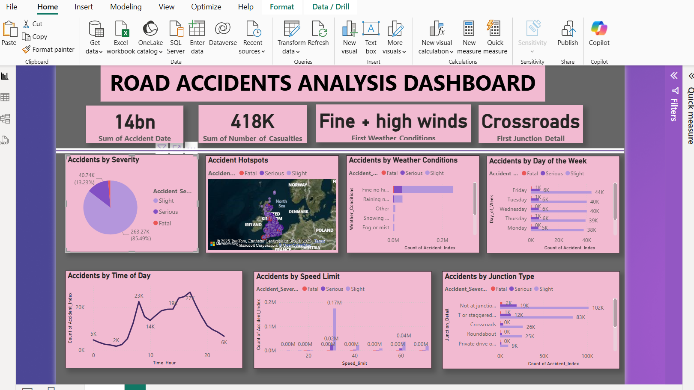

# 🚦 Road Accidents Analysis Dashboard  

## Project Overview  
This project analyzes road accident data to identify **high-risk locations, causes, and trends** for safety improvements. The analysis includes **data loading, preprocessing, exploratory data analysis (EDA), predictive modeling, and visualization** in Power BI.  

## Tools & Technologies  
- **Power BI** (DAX, Power Query, Maps)  
- **Excel, SQL**  
- **Python (for predictive modeling)**  

##  Key Insights  

1 **Accident Severity Distribution**  
   - **85.49%** of accidents are slight, while serious and fatal cases require targeted safety measures.  

2 **High-Risk Weather Conditions**  
   - Most accidents occur during **fine weather with high winds**, followed by rain and fog.  

3 **Accident Hotspots**  
   - Dense accident clusters appear in **high-traffic urban areas and major highways**.  

4 **Time of Day Trends**  
   - Peak accident times: **7 AM - 9 AM (morning rush) & 4 PM - 7 PM (evening rush)**.  
   - Late-night hours have the lowest accident rates.  

5 **Speed Limit Impact**  
   - **20-40 mph zones** report the highest accidents, likely due to urban congestion.  
   - Fewer but more severe accidents occur at **higher speeds (50-60 mph)**.  

6 **Day of the Week Trends**  
   - **Fridays and Tuesdays** have the most accidents.  
   - **Weekends see fewer accidents**, possibly due to lighter traffic.  

7 **Junction Types & Accidents**  
   - **Crossroads and staggered junctions** are high-risk areas.  
   - **Roundabouts and private driveways** have fewer recorded accidents.  

##  Predictive Modeling: Accident Severity Prediction  
A **Random Forest model** was trained to classify accident severity with:  
- **Accuracy:** 81.03%  
- **Weighted F1-score:** 78%  

## Interactive Dashboard  
The Power BI dashboard provides **real-time insights** into accident trends, severity, and risk factors.  

## Screenshots

###  Dashboard Overview

